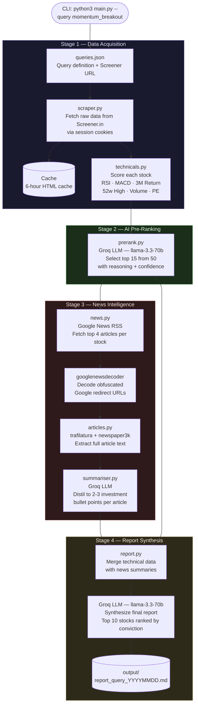

# Make Me Money

An automated AI-powered equity research pipeline for Indian stock markets. The system screens stocks from Screener.in, evaluates technical setups, aggregates and summarizes relevant news, and produces a ranked investment research report — entirely without manual intervention.

---

## Architecture



---

## Report Output Format

Each stock in the final report includes:

- **Technical Case** — RSI zone, MACD signal, 3-month return, proximity to 52-week high, valuation
- **News Evidence** — Investment-relevant bullet points with links to source articles
- **Confidence** — HIGH / MEDIUM / LOW with rationale
- **Key Risk** — The single biggest factor that could invalidate the trade

---

## Queries Available

The agent supports multiple pre-built screening strategies. All queries and their Screener.in URLs are defined in `stock_agent/config/queries.json`.

| Query | Strategy |
|---|---|
| `momentum_breakout` | Mid/large cap with strong momentum and rising volume |
| `oversold_reversal` | Oversold quality stocks with early reversal signals |
| `smallcap_growth` | Small cap with high sales and profit growth |
| `dividend_value` | Blue chip value with strong dividend support |
| `quality_at_fair_value` | High ROCE, low debt, reasonable valuation |
| `high_roce_compounder` | Long-duration compounders, 25%+ ROCE |
| `undervalued_midcap` | Midcap stocks with PE < 15 and solid ROE |
| `sector_rotation_infra` | Infrastructure plays with sales growth momentum |
| `turnaround_candidates` | Beaten-down stocks with improving fundamentals |
| `fii_buying_largecap` | Large cap with price strength and clean balance sheet |

---

## Quickstart

```bash
cd stock_agent
pip install -r requirements.txt

# Copy and fill in your credentials
cp .env.example .env

# Run a query
python3 main.py --query momentum_breakout

# Force fresh data (bypass 6h cache)
python3 main.py --query quality_at_fair_value --no-cache

# Change number of stocks in final report
python3 main.py --query smallcap_growth --top 5
```

See `stock_agent/README.md` for full configuration details.

---

## Tech Stack

| Component | Technology |
|---|---|
| Data source | Screener.in (session-authenticated scrape) |
| Pre-ranking LLM | Groq — llama-3.3-70b-versatile |
| News summarization LLM | Groq — llama-3.3-70b-versatile |
| Report synthesis LLM | Groq — llama-3.3-70b-versatile |
| Article extraction | trafilatura, newspaper3k |
| News aggregation | Google News RSS + googlenewsdecoder |
| Data processing | pandas |
| Local inference (optional) | Ollama |
